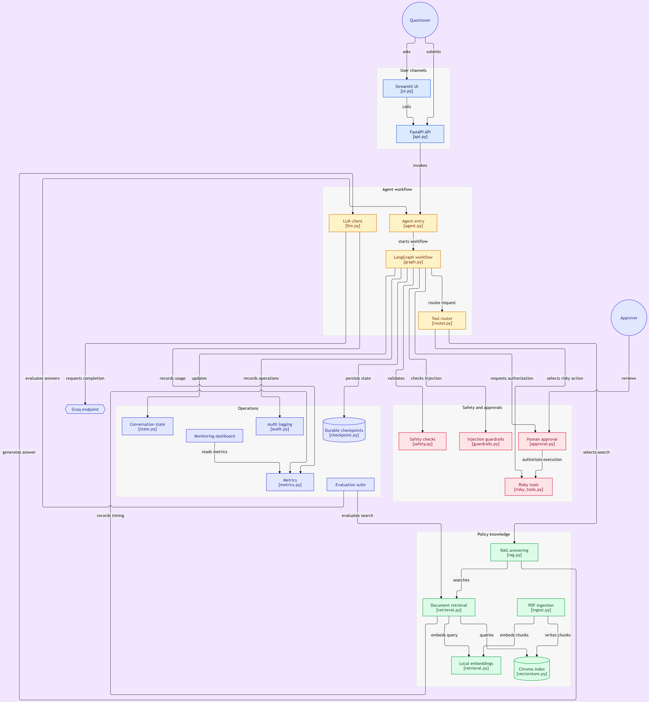

# Company Policy Agent

A production-oriented Company Policy Agent that answers employee policy questions using **RAG (Retrieval-Augmented Generation)**, routes requests through a **LangGraph** workflow, and applies **human approval** before consequential employee-data or external-communication actions.

## Architecture

The system supports both interactive and programmatic access through Streamlit and FastAPI.

<p align="center">
  
</p>

### Request flow

1. A **Questioner** submits a question through the Streamlit UI or FastAPI API.
2. The request enters the **agent workflow**.
3. LangGraph manages the workflow state and routes the request to the appropriate capability.
4. The **LLM client** generates or evaluates responses and is connected to the **Groq** API.
5. Policy questions use the **RAG layer**:
   - PDF policy documents are ingested and chunked.
   - `sentence-transformers/all-MiniLM-L6-v2` creates embeddings.
   - Chroma stores and retrieves the document vectors.
   - Retrieved evidence is used to generate grounded answers.
6. **Safety checks** and **prompt-injection guardrails** validate requests and outputs.
7. Read-only operations can execute normally, while risky operations such as employee updates, deletion, or email require **human approval**.
8. **Durable checkpoints**, audit logging, metrics, and evaluation data support recovery, monitoring, and debugging.
9. The final response includes relevant answer information together with sources, tools used, and trace metadata where applicable.

## Key Features

### RAG-based policy answering

- Retrieves relevant content from company policy documents.
- Uses Hugging Face `sentence-transformers/all-MiniLM-L6-v2` embeddings.
- Uses Chroma as the local vector store.
- Reports retrieved sources with answers.
- Applies a retrieval-distance threshold to avoid using weak matches.

### LangGraph agent workflow

- Uses LangGraph to coordinate the agent workflow.
- Routes requests according to their intent.
- Maintains conversation and workflow state.
- Supports durable checkpointing with SQLite.

### Human-in-the-loop approval

Risky actions are not executed immediately.

Examples include:

- `update_employee_record`
- `delete_employee_record`
- `send_email`

The system creates an approval request and waits for an approver before execution.

Example flow:

```text
User request
    ↓
Risky action detected
    ↓
Approval request created
    ↓
Status = PENDING
    ↓
Human reviews
    ↓
APPROVED → Execute action
REJECTED → Do not execute
```

### Safety and security

- Input validation
- Output validation
- Prompt-injection detection
- Guardrails around tool usage
- Least-privilege tool design
- Audit logging
- Request IDs and trace metadata
- Human approval for consequential actions

### Production monitoring

The API exposes:

- `/health` — service health
- `/ready` — readiness and configuration checks
- `/metrics` — request, latency, LLM, token, error, and cost metrics
- `/chat` — agent interaction endpoint

The project also tracks:

- p50 and p95 latency
- LLM token usage
- model selection
- estimated cost per query
- request success/error counts
- retrieval latency
- LLM latency

## Technology Stack

| Area | Technology |
|---|---|
| UI | Streamlit |
| API | FastAPI |
| Agent orchestration | LangGraph |
| LLM provider | Groq |
| Small model | `openai/gpt-oss-20b` |
| Large model | `openai/gpt-oss-120b` |
| Safety model | `openai/gpt-oss-safeguard-20b` |
| Embeddings | `sentence-transformers/all-MiniLM-L6-v2` |
| Vector database | Chroma |
| Document loading | PyPDF |
| State persistence | SQLite / LangGraph checkpointing |
| Containerization | Docker |
| Tracing | LangSmith |
| Testing | Pytest |
| Linting | Ruff |

## Project Structure

```text
week2day5proj1/
├── app/
│   ├── agent.py
│   ├── api.py
│   ├── approval.py
│   ├── async_agent.py
│   ├── async_tools.py
│   ├── audit.py
│   ├── checkpoint.py
│   ├── graph.py
│   ├── guardrails.py
│   ├── ingest.py
│   ├── llm.py
│   ├── metrics.py
│   ├── retrieval.py
│   ├── risky_tools.py
│   ├── router.py
│   ├── safety.py
│   └── state.py
├── data/
│   ├── hr_policy.pdf
│   ├── company_policy.pdf
│   └── it_policy.pdf
├── docs/
│   └── architecture.png
├── evals/
│   ├── evaluate_routing.py
│   ├── evaluate_injection.py
│   ├── evaluate_retrieval.py
│   ├── analyze_latency.py
│   └── cost_model.py
├── storage/
│   ├── chroma/
│   └── checkpoints/
├── tests/
├── Dockerfile
├── docker-compose.yml
├── requirements.txt
├── SECURITY.md
├── PRODUCTION_EVIDENCE.md
├── DEMO_SCRIPT.md
└── README.md
```

## Running the Application

### 1. Clone the repository

```bash
git clone https://github.com/hsmshubham007-code/capstone-agent.git
cd capstone-agent
```

### 2. Create and activate the virtual environment

Windows PowerShell:

```powershell
py -3.12 -m venv venv
.\venv\Scripts\Activate.ps1
```

### 3. Install dependencies

```powershell
python -m pip install -r requirements.txt
```

### 4. Configure environment variables

Create a `.env` file using `.env.example`.

The application uses Groq rather than the OpenAI API directly.

Example model configuration:

```text
GROQ_MODEL=openai/gpt-oss-20b
GROQ_LARGE_MODEL=openai/gpt-oss-120b
GROQ_SAFETY_MODEL=openai/gpt-oss-safeguard-20b

EMBEDDING_MODEL=sentence-transformers/all-MiniLM-L6-v2

LANGCHAIN_TRACING_V2=true
LANGCHAIN_PROJECT=week2day5proj1
```

Do not commit `.env` or API keys to Git.

### 5. Start the API

```powershell
python -m uvicorn app.api:app --host 127.0.0.1 --port 8000 --reload
```

API documentation:

```text
http://127.0.0.1:8000/docs
```

### 6. Start Streamlit

In another terminal:

```powershell
streamlit run app/ui.py
```

## Docker

Build and run the production container:

```bash
docker compose up --build
```

The FastAPI service is exposed on port `8000`.

## Example Policy Query

```text
What is the company's leave policy?
```

The agent retrieves relevant policy content from Chroma and generates a grounded response with the retrieved source information.

## Example Human Approval Request

```text
Update employee ID EMP002 salary to ₹90,000 per month.
Ask for human approval before making the change.
```

The system returns an approval request instead of modifying the employee record immediately.

Example:

```text
Human approval is required before executing update_employee_record.

Approval request ID: approval-1
Status: PENDING

No changes have been made.
```

## Evaluation

The recorded routing evaluation contains **32 test cases** across approval, company, HR, IT, out-of-scope, and prompt-injection categories.

Recorded results:

| Evaluation | Result |
|---|---:|
| Routing cases | 32/32 |
| Prompt-injection cases | 5/5 |
| Overall routing pass rate | 100% |
| Prompt-injection evaluation | 100% |

These results describe the tested evaluation set and are not a guarantee of correctness for every possible production query.

## Performance and Cost Evidence

The production evaluation tracks:

- p50 latency
- p95 latency
- cold-start behavior
- retrieval latency
- LLM latency
- token usage
- estimated cost per query
- projected monthly cost

The model-routing design attempts the smaller model first and can escalate to the larger model when required.

The documented cost projection used:

- 1,000 prompt tokens/query
- 300 completion tokens/query
- 10% large-model routing

Under those assumptions, the recorded routed-model estimate was **$0.0001815/query**.

See:

- `PRODUCTION_EVIDENCE.md`
- `FINAL_REPORT.md`
- `evals/`
- `evaluation_results.json`

## Security

The system is designed around a least-privilege approach:

- Search/retrieval is read-only.
- Consequential tools require approval.
- Prompt injection is checked before execution.
- Inputs and outputs are validated.
- Tool calls and outcomes are audited.
- Secrets are kept in environment variables.

See [`SECURITY.md`](SECURITY.md) for the security documentation.

## Production Readiness

The project includes:

- FastAPI API
- Streamlit UI
- Docker deployment
- Health and readiness endpoints
- Metrics endpoint
- Structured logging
- Audit events
- LangSmith tracing
- Durable checkpoints
- Human approval workflow
- Automated tests
- Routing evaluation
- Injection evaluation
- Retrieval evaluation
- Latency analysis
- Cost projection
- CI/regression checks

## Documentation

- [`PRODUCTION_EVIDENCE.md`](PRODUCTION_EVIDENCE.md) — production evidence and verification
- [`FINAL_REPORT.md`](FINAL_REPORT.md) — final project report
- [`SECURITY.md`](SECURITY.md) — security design and limitations
- [`DEMO_SCRIPT.md`](DEMO_SCRIPT.md) — demonstration flow
- [`FAILURE_MODES.md`](FAILURE_MODES.md) — failure modes and mitigations
- [`sprint_board.md`](sprint_board.md) — project progress and delivery tracking

## Limitations

- Evaluation results are based on a finite test set.
- Prompt-injection tests demonstrate behavior against the tested cases, not immunity against unseen attacks.
- Cold starts can increase latency before models and vector infrastructure are warmed.
- LLM/provider rate limits can affect availability.
- Chroma dependency security findings should continue to be monitored until fixed versions are available.
- Cost figures are projections based on explicit token and routing assumptions, not guaranteed provider billing totals.

## License

This project is intended as an educational and production-engineering capstone project.
